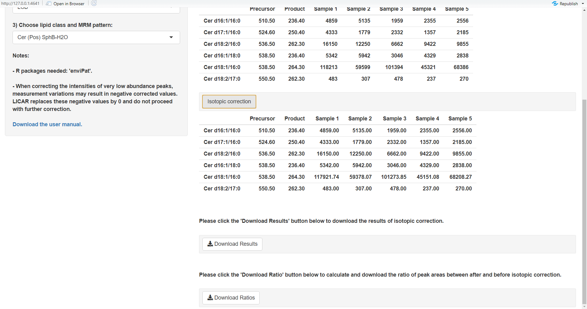

```{r setup, include=FALSE}
knitr::opts_chunk$set(echo = TRUE)
```

 This document constitutes a brief introduction to using SLING's Lipids Isotopic Correction Application in R (LICAR).
 LICAR is a Shiny application that takes _.csv_ (comma separated values) files containing targeted lipidomics (_i.e._ peak abundance data, such as areas under the curve of lipid species in a batch of samples analysed by MRM) and applies isotopic correction based on the used MRM patterns. Note that this is only applicable when lipid species within a given lipid class have been analysed by _**MRM**_ and have _**not**_ been chromatographically separated.


## 1.Prepare the .csv files

### 1.1.Separate data based on lipid classes and MRM patterns
 Peak integration data should be prepared in separate _.csv_ files for each lipid class and MRM pattern. For example, if PE were measured both in positive ionisation using MRM transitions based on the neutral loss of 141 _**and**_ in negative ionisation using fatty acyl-based MRM transition, then these data will be prepared in _**two separate files**_, as shown in Figure 1. 
 When uploading data files to the application (see section 3.1), failure to separate lipid classes in separate files should results in the error message \textcolor{red}{"Lipid class is not unique, please check the data!"}
 

{width=12cm}

### 1.2.General _.csv_ template
 As seen in Figure 1, the _.csv_ files have the following structure:

* the first column lists the lipid names. Please refer to section 1.3. for important notes about lipid naming requirements.
* the second columns lists the precursor ion _m/z_
* the third column lists the product ion _m/z_
* subsequent columns contain the lipids abundance values to be corrected
* Please note that the first row is reserved for column names

 Example templates for all lipid classes currently covered by LICAR are available at:
 
 [https://github.com/SLINGhub/LICAR](https://github.com/SLINGhub/LICAR/).
 
 
 Please note that:

* the MRM transitions listed are by no means exhaustive, the application will "read" any lipid species within a covered class.
* to correct a lipid species (_e.g._ PC&nbsp;34:1) based on the abundance of an interfering species (_e.g._ PC&nbsp;34:2), both transitions must have been measured! Accurate isotopic correction in targeted lipidomics assumes that all species that could/do contribute to isotopic interference are measured so that this interference can be calculated using this application.
* LICAR currently comes with 25 pre-set from various lipid classes commonly measured in lipidomics studies. Advanced users can easily add their own MRM transition patterns for other lipid classes to extend the lipid coverage of this application.
 

### 1.3.Lipid naming    

{width=0.5cm} **This part is important!**  
 
 As mentioned above, the first column of the _.csv_ files contains the lipid species names.
 The algorithm "reads" those names to determine the formula of the relevant fragment used in the calculation. Therefore, the names must conform to a specific nomenclature that the algorithm understands.
 
 * The lipid class abbreviation must follow pre-defined abbreviations. These are listed in Table 1 (_e.g._ "PC" in "PC&nbsp;34:1").  
 * There must be a space between the lipid class abbreviation and the carbon number (_e.g._ "PC&nbsp;34:1" is acceptable, while "PC34:1" is not).  
 * The number of carbon and the number of unsaturations must be separated by a colon, as per accepted lipid nomenclature (_e.g._ "PC&nbsp;34**:**1", "PC&nbsp;16**:**0/18**:**1").  
 * For fatty acyl-based transitions in glycerophospholipids, the fatty acyl chains can be separated by either a "/" or a "\_" (_e.g._ both "PC&nbsp;16:0/18:1" and "PC&nbsp;16:0\_18:1" are acceptable). Do note, however, that **the order in which the fatty acids are listed defines which transition is used**. In the default settings, transitions are defined by the fatty acyl chain **after** the separator. For example, measuring PC&nbsp;16:0/18:1 with fatty-acyl based MRMs will make use two transitions: 804.6&nbsp;->&nbsp;255.2 (for FA&nbsp;16:0) and 804.6&nbsp;->&nbsp;281.2 (for 18:1). In this case, the algorithm will read "PC&nbsp;18:1\_**16:0**" as representing the transition 804.6&nbsp;->&nbsp;**255.2** , while "PC&nbsp;16:0\_**18:1** will be understood as representing 804.6&nbsp;->&nbsp;**281.2**. It is essential to adhere to nomenclature for the application to apply the appropriate correction. For more examples, please refers to the highlighted lipid names in Figure 1, right panel.
 * For sphingolipids long chain base-related transitions, the transitions are defined by the number **before** the separator. For example, Cer&nbsp;**d18:1**/16:0 will be understood as transition 538.5&nbsp;->&nbsp;**264.3**, while Cer&nbsp;**d16:1**/16:0 will be understood as transition 510.5&nbsp;->&nbsp;**236.4**.
 
 Please refer to the provided templates to see more example of such nomenclature.
\newpage

```{r echo=FALSE}
library(knitr)
library(kableExtra)
Table1 <- read.csv(file = "Table1.csv", check.names=FALSE)
kbl(Table1, caption = "Lipid classes, abbreviations, product ion types and MRM patterns used in LICAR.", booktabs = T) %>%
kable_styling(latex_options = c("striped", "scale_down")) %>% 
  footnote(general = c("* See section 3.2","** See section 3.3"),
           general_title = "")
```
 

## 2.Start the application

### 2.1.Shinyapps.io

 The easiest way the run LICAR is to use _via_ Shinyapps.io.
 
 LICAR is available at [https://slinghub.shinyapps.io/LICAR/](https://slinghub.shinyapps.io/LICAR/), where it can be used directly without any installation. 
 
 Alternatively, you may download and install the application by following steps 2.2. to 2.4 below.


### 2.2.Download the code

 The R scripts and templates are provided as an [RStudio](https://www.rstudio.com/products/RStudio) project. You can download the Github repository (https://github.com/SLINGhub/LICAR.git) and open the Rstudio project. Alternatively, you can clone this repository using git, _e.g._ in RStudio.
 
### 2.3.Prerequisites

 The following packages must be installed in R to run the scripts
 
* `enviPat`
* `stringr`
* `shiny`

### 2.4.Run the Shiny App

 Open the script `app.R` and click on the 'Run App' button.
 
 \newpage

## 3.Proceed with isotopic correction.


Upon starting the application, you will see its user interface, as shown in Figure 2.
 
{width=14cm} 
 
### 3.1.Upload _.csv_ file
 
 Click the “Browse” button under “1) Choose CSV file” to upload your data. Navigate to the file of your choice and validate. Upon loading the _.csv_ file, its content will be previewed in the application window, as shown in Figure 3. You may preview only the first few lines of the file (choose "Head" under "Data preview") or its entirety (choose "All" under "Data preview") in the right section of the user interface. You may thus verify that your data has been uploaded.
 
{width=14cm}

### 3.2.Choose the type of product ion

 Once your data is uploaded successfully, please choose the relevant type of product ion in the drop-down menu under "2) Choose product ion type”.
 There are three choices: 
 
 * **Head Group**: for headgroup related fragmentation (_e.g._ product ion of 184 for PC, neutral loss of 141 for PE...).
 * **FA**: for fatty acyl-related product ions (_e.g._ fatty acid fragments of phospholipids in negative ionisation). 
 * **LCB**: for long chain base-related product ions (_e.g._ ceramides transitions as in Figures 3-5).
 
 In the example in Figure 4, we choose "LCB" as we are correcting ceramides data.

{width=14cm}

 Choosing a wrong product ion type will result in the following error message: \textcolor{red}{"Lipid class is wrong, please choose the class again!"}

### 3.3.Specify the MRM pattern.

 Upon selection of the product ion type, one last drop-down menu will appear asking the user to choose lipid class and MRM pattern. Although we have pre-set a total of 25 MRM transitions pattern for various lipid classes, the application pre-selects the relevant ones based on the uploaded data and the product ion type selected in section 3.2. In the example given in Figure 5, only one option remains. In other cases, two or three options may remain.

{width=14cm}


 We have pre-set 25 MRM transition patterns from various lipid classes commonly measured in our lab. However, advanced users can easily add their own MRM transition patterns for other lipid classes to extend the lipid coverage of our application.

### 3.4.Isotopic correction
 After verifying the data and choosing the relevant fragmentation pattern and lipid class, click the “Isotopic correction” button to perform isotopic correction. The results of the correction appear in the application window, and get be exported as _.csv_ files by clicking on "Download results". (Figure 6) 
 
{width=14cm}
 
 The user can also export the result as ratio of peak areas between after and before isotopic correction, by clicking on "Download ratios". These ratios, demonstrates the isotopic effect on specific lipid species, and can be a useful reference.


